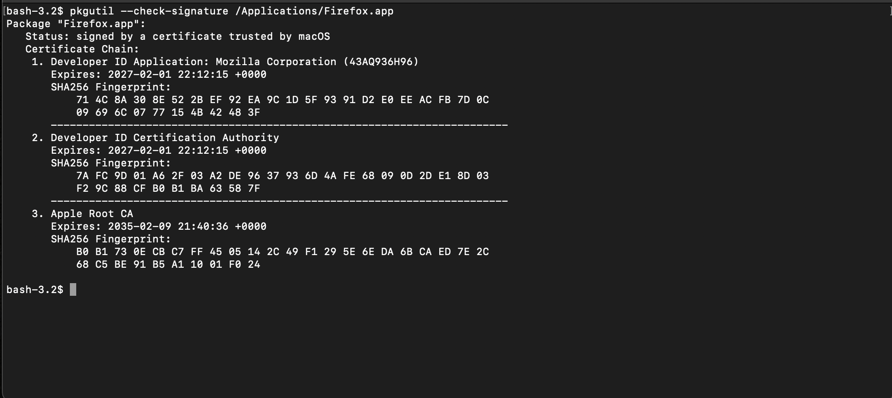
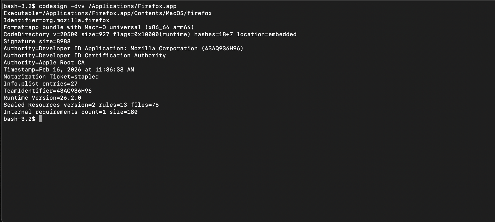
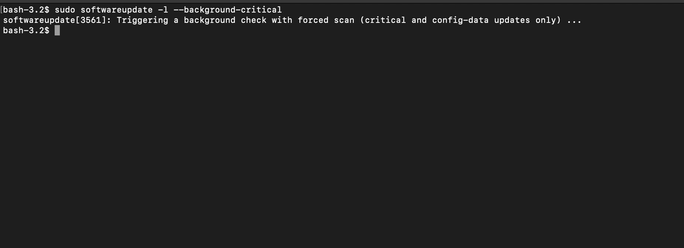
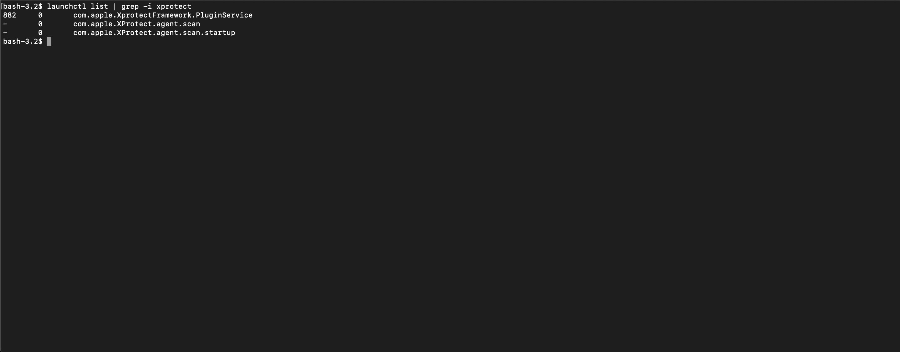

# 01 – Integrity, SIP, XProtect, and Plist Inspection

## 1. Verify package and app signatures

### 1.1 Verify installation integrity (installer packages)

Check that a `.pkg` file is signed and by whom:

```bash
pkgutil --check-signature /path/to/file.pkg
```



You should see:

* Whether the package is signed
* The signing certificate and issuer

This is useful for verifying vendor installers or anything downloaded from the web.

### 1.2 Examine application code signatures

Inspect a compiled app bundle:

```bash
codesign -dvv /Applications/SomeApp.app
```



Flags:

* `-d` – display information
* `-v` – verbose (add another `v` for more detail)

You care about:

* `Authority` chain (who signed it)
* `TeamIdentifier`
* Whether it is “hashed” and “valid”

Suspicious or ad-hoc signatures are a red flag.

## 2. System Integrity Protection (SIP)

Check SIP status:

```bash
csrutil status
```

You generally want SIP **enabled** on a high-risk workstation. Disabling SIP opens up more raw power but also more attack surface. Note that some operations (including forcibly toggling some Apple security services) are only possible with SIP disabled.

## 3. Kernel extensions and system binary auditing

List all loaded kernel extensions:

```bash
kextstat
```

`kextstat` still works but is the legacy tool. On Apple Silicon and current macOS, prefer:

```bash
kmutil showloaded
```

On modern macOS you should see relatively few third-party kernel extensions. A long list of unknown vendors is a problem.

Reload the audit configuration (only if you have intentionally enabled auditd):

```bash
sudo audit -s
```

This tells `auditd`, where it is enabled, to re-read its configuration. It does not scan or audit system binaries. The OpenBSM audit subsystem is disabled by default on macOS 14 and later, so on a standard system this command has nothing to reload. See `05-logging-and-auditing.md` for current status and the supported enable path.

## 4. Understanding plists

macOS uses property list (.plist) files for:

* Launch daemons and agents
* Application preferences
* System configuration

They are typically XML or binary plists.

To inspect a plist in a readable, structured way:

```bash
plutil -p /path/to/file.plist
```

`-p` prints the plist in a “pretty” JSON-like format. This is useful when:

* You are reviewing a launch daemon / agent configuration
* You are checking whether a specific key is enforced (such as: firewall, loginwindow behavior)
* You are diffing before/after behavior during an investigation

Example:

```bash
plutil -p /Library/Preferences/com.apple.alf.plist
```

lets you inspect firewall preferences directly.

Be careful when editing plists manually; corrupted plists can break services. Prefer using `defaults write` or configuration profiles unless you know exactly what you are doing.

## 5. XProtect – ensuring it is running and updated

XProtect is Apple’s built-in signature-based malware scanner. It is not a full EDR, but it is deeply integrated and should be enabled and up to date.

### 5.1 Verify XProtect daemons are present

XProtect is managed by the operating system, and its LaunchDaemons live under SIP-protected system paths. On a healthy system they are already loaded, so manual loading is rarely needed, and the legacy `launchctl load -w` syntax often errors against system-managed services. Verify presence first:

```bash
ls /Library/Apple/System/Library/LaunchDaemons | grep -i xprotect
launchctl list | grep -i xprotect
```

If the daemons are genuinely missing rather than just idle, treat that as a sign something is wrong with the system rather than something to force back on by hand, and investigate before trusting the machine. Plist names can change between releases, so confirm the exact names from the `ls` output rather than assuming them.

### 5.2 Trigger a background critical update check

```bash
sudo softwareupdate -l --background-critical
```



You should see logs similar to:

> Triggering a background check with forced scan (critical and config-data updates only)

XProtect signature updates are delivered via Apple’s update mechanism. Keeping this working is critical.

### 5.3 Checks (Wazuh / CIS logic)

To verify XProtect daemons are present:

```bash
launchctl list | grep -i xprotect
launchctl list | grep com.apple.XProtect.daemon.scan
launchctl list | grep com.apple.XProtect.daemon.scan.startup
```



You want each command to return a single line (count of `1` if scripted). If they are missing, you have a problem and should investigate before trusting the system.

### 5.4 SIP interaction

If you discover it has been disabled without your knowledge, treat the system as compromised:

* Collect evidence and logs
* Assume persistence may exist
* Plan a clean reinstall and key rotation
