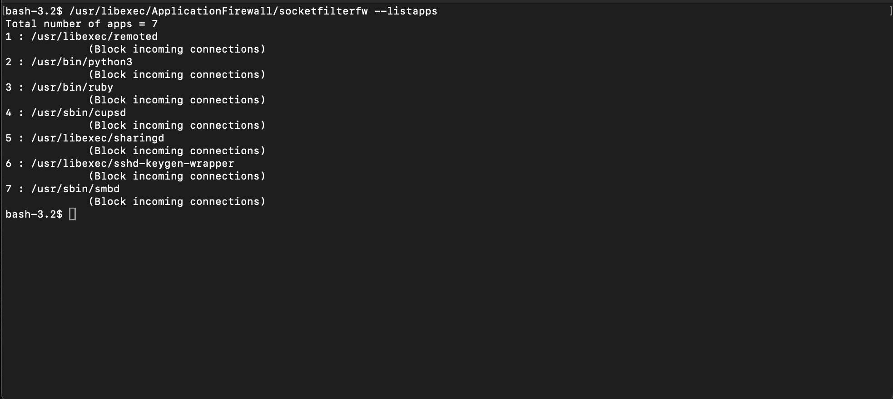

# 03 – Firewall and Networking

## 1. Application Firewall (socketfilterfw)

Enable the firewall:

```bash
sudo /usr/libexec/ApplicationFirewall/socketfilterfw --setglobalstate on
````

Enable stealth mode (ignore unsolicited probes like ICMP ping):

```bash
sudo /usr/libexec/ApplicationFirewall/socketfilterfw --setstealthmode on
```

The Application Firewall controls inbound connections and listening services only. It does not filter outbound traffic. If you need outbound control, see `docs/09-third-party-tools.md`.

By default, macOS automatically allows both built-in signed software and downloaded signed software to receive incoming connections. Review that state before deciding whether to change it.

### 1.1 Automatic allow for signed software (review before changing)

Check the current state first:

```bash
sudo /usr/libexec/ApplicationFirewall/socketfilterfw --getallowsigned
```

You will see two separate settings: automatic allow for built-in signed software, and automatic allow for downloaded signed software.

On a standard workstation, leave both enabled. Disabling them gives you tighter control over what can accept inbound connections, but on macOS 15 Sequoia and later it commonly breaks normal app and browser connectivity, and the failures are hard to diagnose because they look like network problems rather than firewall rules. The macOS 15 firewall was reworked, and the per-app controls in System Settings can fail to save, leaving the command line as the only way to recover. Treat the following as advanced, and test it on a non-primary machine first:

```bash
# Advanced and high-friction. Expect breakage on Sequoia and later.
sudo /usr/libexec/ApplicationFirewall/socketfilterfw --setallowsigned off
sudo /usr/libexec/ApplicationFirewall/socketfilterfw --setallowsignedapp off
```

Rollback if anything stops connecting:

```bash
sudo /usr/libexec/ApplicationFirewall/socketfilterfw --setallowsigned on
sudo /usr/libexec/ApplicationFirewall/socketfilterfw --setallowsignedapp on
```

### 1.2 Manage specific applications

Add an app:

```bash
sudo /usr/libexec/ApplicationFirewall/socketfilterfw --add /path/to/app
```

Block an app explicitly:

```bash
sudo /usr/libexec/ApplicationFirewall/socketfilterfw --blockapp /path/to/app
```

List firewall-registered apps:

```bash
sudo /usr/libexec/ApplicationFirewall/socketfilterfw --listapps
```



Whenever you change firewall configuration, reload the daemon:

```bash
sudo pkill -HUP socketfilterfw
```

### 1.3 Check firewall status via defaults (legacy, pre-Sequoia only)

On macOS 14 Sonoma and earlier you could read firewall state from a property list:

```bash
defaults read /Library/Preferences/com.apple.alf globalstate
```

This no longer works on macOS 15 Sequoia or later. Apple removed the `com.apple.alf` property list, and `socketfilterfw` is now the only supported interface. On current systems, read state directly:

```bash
/usr/libexec/ApplicationFirewall/socketfilterfw --getglobalstate --getblockall --getallowsigned --getstealthmode
```

The older `defaults read` value, where present, used:

* `0` disabled
* `1` enabled for specific services
* `2` enabled for essential services only

Treat the plist value as a compatibility-only check, not a source of truth on modern macOS.

## 2. Remote access and unused protocols

Disable remote login (SSH):

```bash
sudo systemsetup -setremotelogin off
```

Disable wake on modem (legacy, but still worth setting off):

```bash
sudo systemsetup -setwakeonmodem off
```

Disable IPv6 on Wi-Fi (example interface):

```bash
sudo networksetup -setv6off Wi-Fi
```

Adjust the interface name (`Wi-Fi`, `Ethernet`, etc.) to match `networksetup -listallhardwareports`.

## 3. Inspecting network-related activity

### 3.1 List running processes

```bash
ps -ef
```

Baseline which processes normally exist on your system.

### 3.2 Open network files and sockets

```bash
sudo lsof -Pni
```

This gives you:

* Process name and PID
* Protocol
* Local and remote address
* State

Combine this with firewall rules and your own expectations. Unexpected listeners are a red flag.

### 3.3 Network statistics

```bash
sudo netstat -atln
```

This shows listening TCP ports and current connections. Focus on `LISTEN` entries that should not be present, and high-volume connections to unexpected remote IPs.

## 4. Network-related logging

Streaming logs live:

```bash
sudo log stream
```

24-hour security-related log view:

```bash
sudo log show --last 24h --predicate 'eventMessage contains "security"' --info
```

Network change logs (SSID, lease, network reconfiguration):

```bash
log show --info --predicate 'senderImagePath contains "IPConfiguration" and (eventMessage contains "SSID" or eventMessage contains "Lease" or eventMessage contains "network changed")'
```

Tune the time range with `--last 1h`, `--last 7d`.

