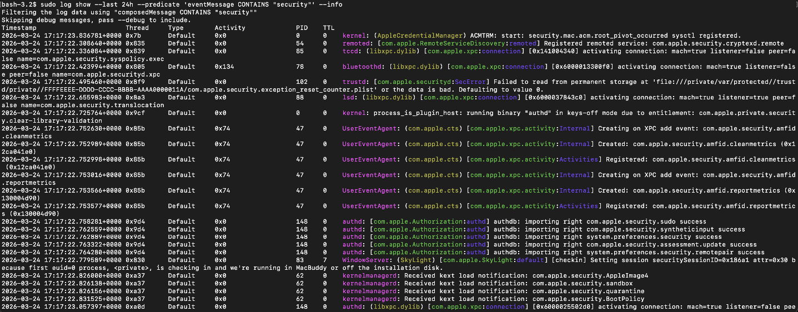

# 05 – Logging, Install Log Retention, and Auditd

You cannot defend what you cannot see. This section focuses on:

- Keeping install logs for at least a year
- Enabling security auditing via auditd (advanced and optional)
- Basic log review commands

Apple has been moving away from traditional `auditd` toward the Unified Logging system. Unified Logging is the right default for routine visibility, and auditd is now an advanced, opt-in control.

## 1. Retain install.log for at least 365 days

The file `/var/log/install.log` records installer activity. Its rotation behavior is controlled by `/etc/asl/com.apple.install`.

Open the config:

```bash
sudo vi /etc/asl/com.apple.install
```

On the `file` line for `/var/log/install.log`:

* Ensure `ttl=365` (or higher) is present.
* Remove any `all_max=` setting.

Example (illustrative only):

```text
? [= Sender Installer] file /var/log/install.log ttl=365 rotate=utc
```

The important parts:

* `ttl=365` – keep entries for at least 365 days.
* No `all_max=...` – do not rotate purely based on size.

Checks (logic borrowed from CIS-style tests):

* `ttl` should be `>= 365`.
* There should be **no** `all_max` on the active (non-commented) line.

## 2. Enabling security auditing (auditd), advanced and optional

Audit logs are low-level event records, such as `open` and `fork` syscalls.

The OpenBSM audit subsystem is deprecated and disabled by default. It has been deprecated since macOS 11 Big Sur, disabled by default since macOS 14 Sonoma, and remains disabled through macOS 15 Sequoia and macOS 26 Tahoe. Apple has stated it will be removed in a future release, and the documented replacement is the Endpoint Security framework. Treat this section as advanced and optional, not a baseline control, and prefer Unified Logging for routine visibility.

If your threat model justifies the overhead, enable it using the method Apple currently documents. The older `launchctl load -w` path is deprecated and should not be used here:

```bash
sudo cp /etc/security/audit_control.example /etc/security/audit_control
sudo launchctl enable system/com.apple.auditd
sudo reboot
```

After the reboot, verify the daemon is running:

```bash
sudo launchctl print system/com.apple.auditd | grep -i state
launchctl list | grep com.apple.auditd
```

Where logs live:

```bash
ls /var/audit
```

These logs can grow quickly. Rotate and archive them according to your storage and retention policy. Misconfiguring the audit subsystem on recent macOS has caused login loops, so test this on a non-primary machine before applying it anywhere you depend on.

## 3. Trigger an audit reload

Any time you change `/etc/security/audit_control` or related config:

```bash
sudo audit -s
```

This forces the audit subsystem to reload configuration and start using any new settings.

## 4. Unified logging – operational queries

While auditd captures syscalls, most day-to-day work will use Unified Logging (`log` command).

Live stream:

```bash
sudo log stream
```

Security-related events over the last 24 hours:

```bash
sudo log show --last 24h --predicate 'eventMessage contains "security"' --info
```



Network changes (SSID, DHCP lease, etc.):

```bash
log show --info --predicate 'senderImagePath contains "IPConfiguration" and (eventMessage contains "SSID" or eventMessage contains "Lease" or eventMessage contains "network changed")'
```

Syslog-related events (if something is using syslog):

```bash
log show --info --debug --predicate 'eventMessage CONTAINS "syslog"'
```

Tighten time windows with:

```bash
--last 1h
--last 7d
--start "2024-01-01 00:00:00" --end "2024-01-02 00:00:00"
```

## 5. Launch agents and daemons visibility

User launch agents:

```bash
launchctl list
```

System daemons:

```bash
sudo launchctl list
```

Inspect a specific service:

```bash
launchctl list com.apple.some.daemon
```

or by grepping:

```bash
launchctl list | grep -i xprotect
```

Use this together with plist inspection (`plutil -p`) to understand:

* What is being launched
* Under what user
* With which program and arguments

Any unexpected or unknown entries deserve a closer look.
