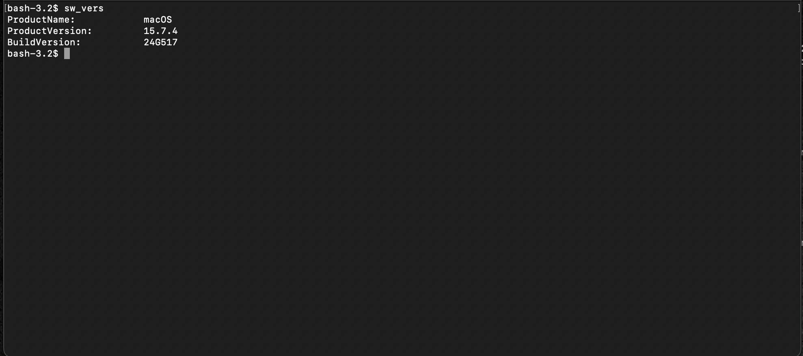

# Compatibility and Version Notes

This repository focuses on modern macOS behavior, but Apple changes security tooling, defaults, and management workflows between releases.

Use this file to understand where commands or assumptions may differ across:

- Ventura
- Sonoma
- Sequoia
- Tahoe

Always confirm your version first:

```bash
sw_vers
````



## General rule

Where two methods exist, prefer:

1. the method Apple currently documents for newer macOS releases
2. direct command-line verification
3. explicit compatibility notes for older behavior

Do not assume that an older plist-based check or legacy daemon workflow still reflects current macOS internals.

## Ventura

Ventura is close enough to modern macOS that most command-line inspection and hardening patterns in this repository still make sense.

Guidance:

* treat built-in command usage as generally applicable
* verify firewall, logging, and DNS behavior directly
* do not assume Ventura and Sequoia behave identically under the hood

## Sonoma

Sonoma remains broadly compatible with most of the repository, but one important caveat applies:

* the deprecated audit subsystem is disabled by default

That means:

* `auditd` should not be treated as a baseline assumption
* unified logging should remain the primary visibility workflow
* any audit-specific control should be framed as optional or advanced, not universal

Recommended approach on Sonoma:

* keep Unified Logging as the default observability layer
* use `auditd` only when you intentionally enable and maintain it
* document when a section assumes `auditd` is present

## Sequoia

Sequoia requires the most care in this repository because Apple changed some security-management assumptions.

### Application Firewall

For Sequoia-era systems, prefer:

```bash
/usr/libexec/ApplicationFirewall/socketfilterfw --getglobalstate
```

and other `socketfilterfw` checks and configuration commands over older property-list assumptions.

If a section references:

```bash
defaults read /Library/Preferences/com.apple.alf ...
```

treat that as a legacy or compatibility-only check, not the primary source of truth for Sequoia.

### Firewall logging

Do not assume older firewall logging guidance still applies unchanged.

On Sequoia, firewall logging behavior and management guidance shifted, so verification should focus on current command-line behavior and current Apple-documented workflows rather than older payload-key assumptions.

### XProtect

XProtect should be treated as:

* built in
* update-dependent
* behaviorally verified, not merely assumed present

Keep these principles in mind:

* XProtect is meant to detect and block known malware
* update state matters
* newer systems may expose more modern command-line interactions than older releases

For Sequoia and newer workflows:

* continue checking that relevant services and update paths are functioning
* review current local man pages where available
* do not rely only on older launchd-era assumptions

### Audit subsystem

If you are carrying forward older audit workflows into Sequoia, document them explicitly as optional or advanced.

Do not imply that a legacy audit path is enabled by default on all current systems.

## Section-specific compatibility notes

## Firewall and networking

Preferred on modern systems:

* `socketfilterfw`
* direct command verification
* live network inspection

Use plist-based checks only as a compatibility note for older macOS behavior.

## Integrity and XProtect

Preferred on modern systems:

* package signature checks
* code signature checks
* update-aware XProtect validation
* local version confirmation before assuming daemon names or behavior

## Logging and auditing

Preferred baseline:

* Unified Logging with `log show` and `log stream`

Use `auditd` only when:

* it is intentionally enabled
* the host actually supports and uses it
* the user understands retention and maintenance implications

## DNS and resolver tooling

Third-party DNS tooling changes over time.

Before using any Homebrew-based DNS workflow:

* confirm the current formula still supports the documented behavior
* confirm the local config paths are still correct
* test resolver behavior after changes instead of trusting install output

## Practical maintenance rule

When a command or workflow may be version-sensitive, add a short note in the relevant doc using this format:

```text
Compatibility note:
Reviewed on Sonoma and Sequoia.
Older plist-based checks may not reflect current behavior on Sequoia.
Prefer socketfilterfw verification on newer systems.
```

## Bottom line

The repository should be read as:

* modern-first
* verification-first
* version-aware

If Apple changes a default, daemon path, logging model, firewall behavior, or management interface, the repository should prefer the newer supported workflow and preserve the older one only as a clearly labeled compatibility note.
