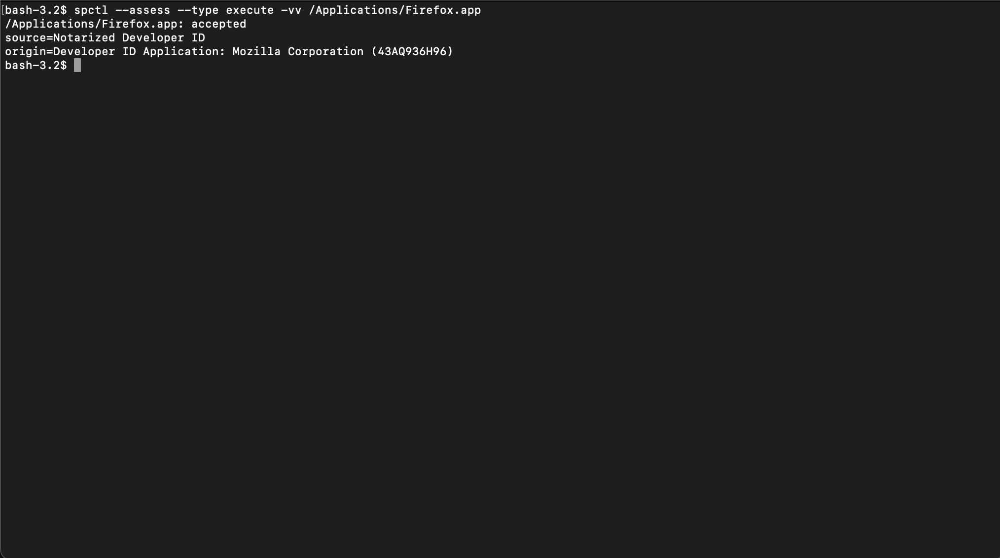
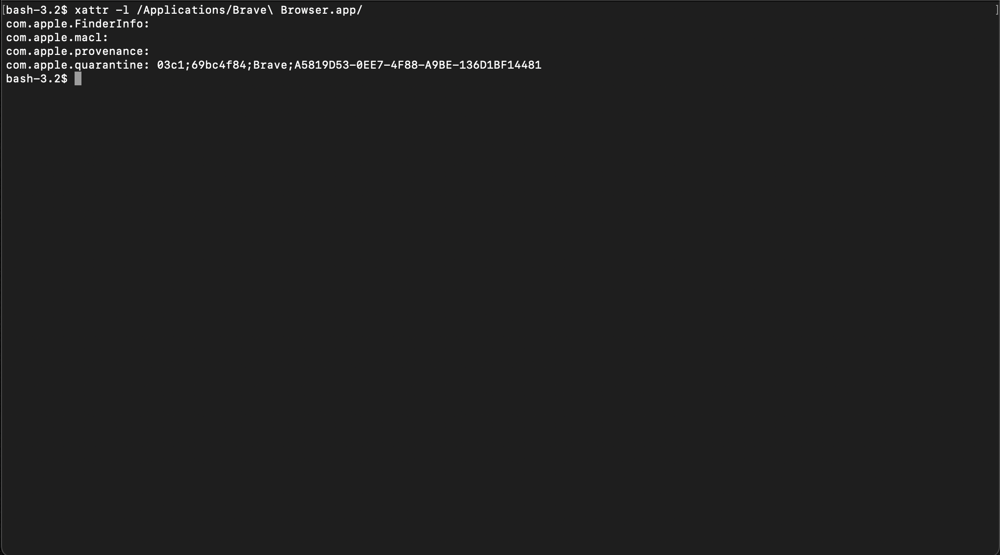

# Gatekeeper and Notarization

Gatekeeper is one of the main control layers that stands between a user and untrusted software.

On modern macOS, Gatekeeper helps verify that downloaded apps, plug-ins, and installer packages are:

- from an identified developer
- notarized by Apple
- not modified after signing

This document focuses on practical checks and operational awareness, not bypasses.

## 1. What Gatekeeper actually does

Gatekeeper is intended to reduce the chance that untrusted or tampered software runs on the Mac.

This matters because:

- code signing alone is not enough if a binary has been altered
- notarization is not a general guarantee of safety, but it is still a meaningful trust signal
- users frequently confuse “it launches” with “it is trustworthy”

Gatekeeper should be treated as one layer in a broader stack that also includes:

- code-signature inspection
- package-signature inspection
- XProtect
- update hygiene
- cautious software sourcing

## 2. Check Gatekeeper status

Check whether assessments are enabled:

```bash
spctl --status
````

Typical output when enabled:

```text
assessments enabled
```

If it reports disabled, that is a red flag on a normal workstation and should be investigated before the machine is trusted.

## 3. Assess an app with Gatekeeper

To assess an application bundle:

```bash
spctl --assess --type execute -vv /Applications/SomeApp.app
```



To assess an installer package:

```bash
spctl --assess --type install -vv /path/to/file.pkg
```

This helps answer:

* whether Gatekeeper accepts it
* whether the code is signed
* whether notarization appears to be in place
* what authority chain is being trusted

Do not confuse a successful assessment with a deep security review. It only means the object passes the checks Gatekeeper is performing.

## 4. Inspect code signatures directly

For apps:

```bash
codesign -dvv /Applications/SomeApp.app
```

What to look for:

* `Authority`
* `TeamIdentifier`
* signing chain consistency
* whether the app appears to be signed by the vendor you expected

For installer packages:

```bash
pkgutil --check-signature /path/to/file.pkg
```

This is useful when comparing what Gatekeeper accepts versus what the vendor actually signed.

## 5. Quarantine awareness

Files downloaded from the internet often receive a quarantine attribute.

Check it:

```bash
xattr -l /Applications/SomeApp.app
```



or for a downloaded installer:

```bash
xattr -l /path/to/file.pkg
```

If you see `com.apple.quarantine`, that indicates macOS has marked the file as downloaded and additional trust checks may apply at first launch.

Quarantine metadata is useful context during investigations because it may help explain why a file triggered extra prompts or checks.

## 6. Operational workflow before opening third-party software

For software obtained outside the App Store, a reasonable workflow is:

1. Verify where it came from.
2. Check the package or app signature.
3. Assess it with Gatekeeper.
4. Confirm the expected developer identity.
5. Only then launch or install it.

This is slower than double-clicking the file blindly, but it is materially safer.

## 7. Gatekeeper override behavior

If macOS blocks an app, do not train yourself to click through warnings automatically.

Instead:

* confirm the vendor
* confirm the signature
* confirm the package or app is what you intended to run
* then review the prompt in Privacy & Security if you are making an explicit exception

A blocked launch is a signal, not an inconvenience to bypass on autopilot.

## 8. Verification checklist

Use this quick check before trusting a downloaded app:

```bash
spctl --status
spctl --assess --type execute -vv /Applications/SomeApp.app
codesign -dvv /Applications/SomeApp.app
xattr -l /Applications/SomeApp.app
```

For packages:

```bash
spctl --assess --type install -vv /path/to/file.pkg
pkgutil --check-signature /path/to/file.pkg
xattr -l /path/to/file.pkg
```

## 9. Bottom line

Gatekeeper is not a silver bullet.

It is a useful trust boundary that should stay enabled on almost all systems. The professional mistake is not using it as a data point. The bigger mistake is assuming that passing Gatekeeper means software is beyond question.
