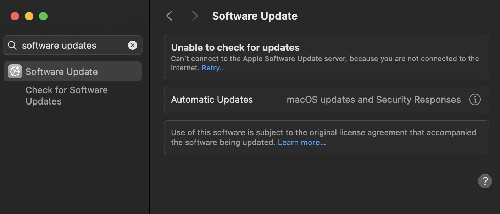
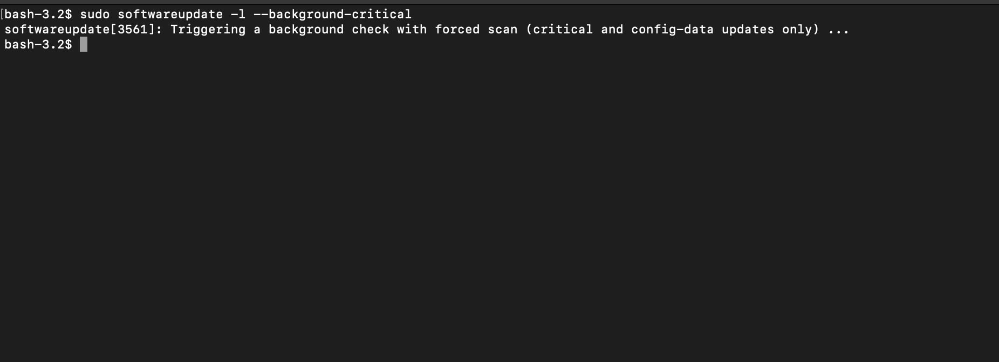

# Update Hygiene and Background Security

A hardened Mac that is not being updated is not hardened for long.

Security posture depends on update posture.

This document focuses on:

- macOS software update settings
- background security improvements
- security responses and system files
- command-line update checks
- operational habits that reduce patch lag

## 1. Why update hygiene matters

Attack surface is not only reduced by configuration. It is also reduced by staying current.

A machine can have:

- FileVault enabled
- firewall enabled
- strong browser settings
- tight privacy permissions

and still remain exposed if it is behind on operating system security updates or background security content.

The most common update mistake is assuming that “I updated recently” is the same as “this machine is current enough.”

It is not.

## 2. Review Software Update settings




On modern macOS, review:

- System Settings
- General
- Software Update

Pay close attention to Automatic Updates and related options.

A strong baseline is to review whether the system is configured to:

- download new updates when available
- install macOS updates
- install application updates from the App Store if you use it
- install security responses and system files automatically

## 3. Background security content

Modern macOS can install security-related content in the background between full OS updates.

This matters because some protections are improved without waiting for a full point release.

Treat background security content as part of baseline security, not as an optional extra.

If you disable automatic installation of security-related background content, you are choosing more patch lag and more manual responsibility.

## 4. Command-line version awareness

Check current OS version:

```bash
sw_vers
````

List available updates:

```bash
softwareupdate -l
```

Install all available updates:

```bash
sudo softwareupdate --install --all
```

This is useful when verifying a machine directly rather than trusting the graphical interface alone.

## 5. Background critical and security-related checks

For background-critical update checks:

```bash
sudo softwareupdate -l --background-critical
```



This can be useful when validating that Apple-delivered critical/configuration update paths are still functioning as expected.

Do not treat command output alone as the full story. Cross-check current settings in System Settings as well.

## 6. App Store update posture

If you use Mac App Store software, make sure application-update behavior is reviewed alongside OS updates.

A system with a current OS but stale first-party or store-delivered apps is still carrying avoidable exposure.

Not every app update is security-relevant, but many are.

## 7. Practical update workflow

A simple professional workflow looks like this:

1. Check `sw_vers`.
2. Check `softwareupdate -l`.
3. Review Software Update settings in System Settings.
4. Confirm that security responses and system files are configured to install automatically.
5. Verify that critical built-in security components such as XProtect are receiving update paths normally.
6. Reboot when needed instead of letting required restarts linger indefinitely.

This is not glamorous. It is still one of the highest-value things you can do.

## 8. When to be more aggressive

You should tighten update discipline further if the machine is:

* used for security research
* used for investigations
* used for sensitive client or business data
* used in a higher-risk environment
* kept internet-connected for long periods

In those cases, patch lag should be treated as a material risk factor.

## 9. Verification checklist

Review:

* current macOS version
* available updates
* Automatic Updates settings
* install security responses and system files setting
* whether restarts are pending or overdue

Commands:

```bash
sw_vers
softwareupdate -l
sudo softwareupdate -l --background-critical
```

## 10. Bottom line

Hardening without update discipline is theater.

A secure baseline is not a one-time setup. It is a maintained state, and update hygiene is one of the clearest signals of whether that state is real.